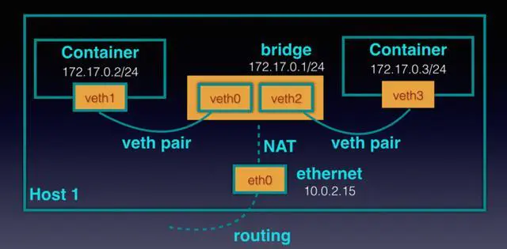

## 1. 容器是什么

引用 [Docker 官网](https://www.docker.com/resources/what-container)对容器的一个定义：

> What is a Container?
>
> A standardized unit of software.

容器是什么？一个软件的**标准化单元**。

我们来分析下这个定义，首先是**软件**，跟容器相关的是软件而不是硬件，而我们也知道软件主要分为系统软件和应用软件，而容器中运行的程序并非系统软件，它实际运行在宿主机上，与宿主机上的其他进程共用一个内核，这也是容器与传统虚拟机的一个很大区别。

再者，**标准化单元**，刚才我们已经说了，容器内运行的程序并非系统软件，每个软件运行都需要有必要的环境，包括一些 lib 库之类的，而如何能在复杂的环境中做到“标准化”呢？显然，**隔离**是一个最佳选择。将程序及其所需的环境 /lib 库之类的组织在一起，并与系统环境隔离，这就很容易做到“标准化”了。

说白了，**容器其实是在一台机器上的“一组”进程，当然这组进程可能只有一个；它们有相同的特性，同样所受的限制也相同；另外既然叫做容器，很自然地我们认为它们与外界可以进行隔离/应该有一个分界线。**

如何隔离? Docker最初基于Linux Container(LXC) ,并在2014年正式发布1.0之前将LXC换成了自己实现的libcontainer,但归根结底,还是基于cgroups、namespace、Union File Systems等技术。

## 2. namespace

### 什么是 namespace

我们仍然以 [Wiki](https://en.wikipedia.org/wiki/Linux_namespaces) 上对 namespace 的定义开始：

> **Namespaces** are a feature of the [Linux kernel](https://en.wikipedia.org/wiki/Linux_kernel) that partitions kernel resources such that one set of [processes](https://en.wikipedia.org/wiki/Process_(computing)) sees one set of resources while another set of processes sees a different set of resources. The feature works by having the same namespace for a set of resources and processes, but those namespaces refer to distinct resources. Resources may exist in multiple spaces. Examples of such resources are process IDs, hostnames, user IDs, file names, and some names associated with network access, and [interprocess communication](https://en.wikipedia.org/wiki/Interprocess_communication).
>
> The term "namespace" is often used for a type of namespace (e.g. process ID) as well as for a particular space of names.

namespace 是 Linux 内核的一项功能，它可以对内核资源进行拆分，使得一组进程可以看到指定的一组资源；而另一组进程可以看到另一组不同的资源。该功能通过对一组资源和进程使用相同的namespace起作用,而这些namespace引用了不同的资源 。资源可能存在于多个空间中。 例如进程ID，主机名，用户ID，文件名以及与网络访问和进程间通信相关的某些名称。

术语“namespace”通常用于一种特定的命名空间（如进程ID）以及特定的名称空间。

简单来说: namespace 是由 Linux 内核提供的，用于进程间资源隔离的一种技术。同时 Linux 也默认提供了多种 namespace，用于对多种不同资源进行隔离。

| namespace 名称 | 系统调用参数    | 含义                                                         |
| :------------- | :-------------- | :----------------------------------------------------------- |
| Mount          | CLONE_NEWNS     | 隔离挂载点                                                   |
| PID            | CLONE_NEWPID    | 进程编号,                                                    |
| Network        | CLONE_NEWNET    | 网络设备，堆栈，端口等                                       |
| IPC            | CLONE_NEWIPC    | 系统 IPC, POSIX 消息队列,用于隔离进程间通信资源              |
| UTS            | CLONE_NEWUTS    | 系统主机名和 NIS(Network Information Service) 主机名（有时称为域名),用于隔离主机名和域名 |
| User           | CLONE_NEWUSER   | 用户和组 ID                                                  |
| Cgroup         | CLONE_NEWCGROUP | Cgroup 根目录                                                |

### 如何使用 namespace

前面提到了 Linux 内核提供了以上 7 种 namespace，那如何去使用它们呢？Linux 提供了以下主要的 API 用于管理 namespace：

- clone()：如果是纯粹只使用 clone()，则会创建一个新进程；但如果我们传递一个或多个 CLONE_NEW* 标志给 clone()，则会根据每个标志创建对应的新 namespace 并且将子进程添加为其成员。
- setns()：允许进程加入一个已存在的 namespace 中。
- unshare()：允许进程（或线程）取消其执行上下文中，与其他进程（或线程）共享部分的关联，当然通俗点来说，也就是可以利用此系统调用来让当前的进程（或线程）移动至一个新的 namespace 中。

查看一个进程的各namespace命令如下：

```shell
[root@centos1 ~]# ll /proc/self/ns --time-style='+'
总用量 0
lrwxrwxrwx. 1 root root 0  ipc -> ipc:[4026531839]
lrwxrwxrwx. 1 root root 0  mnt -> mnt:[4026531840]
lrwxrwxrwx. 1 root root 0  net -> net:[4026531956]
lrwxrwxrwx. 1 root root 0  pid -> pid:[4026531836]
lrwxrwxrwx. 1 root root 0  user -> user:[4026531837]
lrwxrwxrwx. 1 root root 0  uts -> uts:[4026531838]
```

> /proc 是一种虚拟的文件系统。该文件系统挂载于 /proc 目录下，包含了各种用于展示内核信息的文件，并且允许进程通过普通的 I/O 调用来直接读取。/proc 文件系统对于进程都提供了一个 /proc/$PID 的目录，其中包含着进程的详细信息。**/proc/self 实际上指向的就是当前指令所在的进程**
>
> ```shell
> [root@centos1 ~]# ll /proc |grep self
> lrwxrwxrwx.  1 root    root                 11 4月  23 10:55 mounts -> self/mounts
> lrwxrwxrwx.  1 root    root                  8 4月  23 10:55 net -> self/net
> lrwxrwxrwx.  1 root    root                  0 1月  15 14:43 self -> 19543
> [root@centos1 ~]# ll /proc/self/ |grep exe
> lrwxrwxrwx. 1 root root 0 4月  23 10:56 exe -> /usr/bin/ls
> ```

通过这个指令,我们可以看到某个docker容器进程的各namespace

```shell
[root@centos1 ~]# ls -l --time-style="+" /proc/$(docker inspect $(docker ps -ql) --format='{{.State.Pid}}')/ns
总用量 0
lrwxrwxrwx. 1 polkitd input 0  ipc -> ipc:[4026532100]
lrwxrwxrwx. 1 polkitd input 0  mnt -> mnt:[4026532098]
lrwxrwxrwx. 1 polkitd input 0  net -> net:[4026532103]
lrwxrwxrwx. 1 polkitd input 0  pid -> pid:[4026532101]
lrwxrwxrwx. 1 polkitd input 0  user -> user:[4026531837]
lrwxrwxrwx. 1 polkitd input 0  uts -> uts:[4026532099]
```

> `docker ps -ql`可以用来查看查询最近一次创建的容器的containerId。
>
> `docker inspect`用来查看容器的一些信息,`--format`参数使用给定的go-template来格式化输出。

### namespace 详细介绍

#### pid namespace

在容器中，有自己的pid namespace，因此我们看到的只有PID为1的初始进程以及它的子进程，而宿主机的其他进程容器内是看不到的。通常来说，Linux启动后会先启动一个PID为1的进程，这是系统进程树的根进程，根进程会接着创建子进程来初始化系统服务。PID namespace允许在新的namespace创建一棵新的进程树，它可以有自己的PID为1的进程。在PID namespace的隔离下，子进程名字空间无法知道父进程名字空间的进程，如在Docker容器中无法看到宿主机的进程，而父进程名字空间可以看到子进程名字空间的所有进程。

```shell
[root@centos1 ~]# ls -ls /proc/self/ns
总用量 0
0 lrwxrwxrwx. 1 root root 0 4月  23 13:55 ipc -> ipc:[4026531839]
0 lrwxrwxrwx. 1 root root 0 4月  23 13:55 mnt -> mnt:[4026531840]
0 lrwxrwxrwx. 1 root root 0 4月  23 13:55 net -> net:[4026531956]
0 lrwxrwxrwx. 1 root root 0 4月  23 13:55 pid -> pid:[4026531836]
0 lrwxrwxrwx. 1 root root 0 4月  23 13:55 user -> user:[4026531837]
0 lrwxrwxrwx. 1 root root 0 4月  23 13:55 uts -> uts:[4026531838]
[root@centos1 ~]# unshare --fork --pid bash
[root@centos1 ~]# ls -ls /proc/self/ns
总用量 0
0 lrwxrwxrwx. 1 root root 0 4月  23 13:56 ipc -> ipc:[4026531839]
0 lrwxrwxrwx. 1 root root 0 4月  23 13:56 mnt -> mnt:[4026531840]
0 lrwxrwxrwx. 1 root root 0 4月  23 13:56 net -> net:[4026531956]
0 lrwxrwxrwx. 1 root root 0 4月  23 13:56 pid -> pid:[4026532162]
0 lrwxrwxrwx. 1 root root 0 4月  23 13:56 user -> user:[4026531837]
0 lrwxrwxrwx. 1 root root 0 4月  23 13:56 uts -> uts:[4026531838]
[root@centos1 ~]# ps -a
  PID TTY          TIME CMD
19944 pts/1    00:00:00 unshare
19945 pts/1    00:00:00 bash
19957 pts/1    00:00:00 ps
```

可以看到pid的namespace已经不同了,但ps还是能看到父进程,这是因为ps命令是从/proc文件系统读取的数据,而文件系统我们还没有隔离。

```shell
[root@centos1 ~]# unshare --fork --pid --mount-proc bash 
[root@centos1 ~]# ps -a
  PID TTY          TIME CMD
    1 pts/1    00:00:00 bash
   12 pts/1    00:00:00 ps
[root@centos1 ~]# ls -ls /proc/self/ns
总用量 0
0 lrwxrwxrwx. 1 root root 0 4月  23 14:08 ipc -> ipc:[4026531839]
0 lrwxrwxrwx. 1 root root 0 4月  23 14:08 mnt -> mnt:[4026532162]
0 lrwxrwxrwx. 1 root root 0 4月  23 14:08 net -> net:[4026531956]
0 lrwxrwxrwx. 1 root root 0 4月  23 14:08 pid -> pid:[4026532163]
0 lrwxrwxrwx. 1 root root 0 4月  23 14:08 user -> user:[4026531837]
0 lrwxrwxrwx. 1 root root 0 4月  23 14:08 uts -> uts:[4026531838]
```

现在可以看到ps已经只能看到两个进程,且pid从1开始了

#### net namespace

Docker容器中另一个重要特性是网络独立(之所以不用隔离一词是因为容器的网络还是要借助宿主机的网络来通信的)，使用到Linux 的 NET Namespace、vet。veth主要的目的是为了跨NET namespace之间提供一种类似于Linux进程间通信的技术，所以veth总是成对出现，如下面的veth0和veth1。它们位于不同的NET namespace中，在veth设备任意一端接收到的数据，都会从另一端发送出去。veth实现了不同namespace的网络数据传输。


<!--  -->

实际演示一下

```shell
[root@centos1 ~]# docker run -d -it  --rm --name ap1 --network bridge alpine
f4be196f3b552368a31d6739020a5218022a3748b1f6719d8a798af6b2127a95
[root@centos1 ~]# ip addr
1: lo: <LOOPBACK,UP,LOWER_UP> mtu 65536 qdisc noqueue state UNKNOWN group default qlen 1000
    link/loopback 00:00:00:00:00:00 brd 00:00:00:00:00:00
    inet 127.0.0.1/8 scope host lo
       valid_lft forever preferred_lft forever
    inet6 ::1/128 scope host 
       valid_lft forever preferred_lft forever
2: eth0: <BROADCAST,MULTICAST,UP,LOWER_UP> mtu 1500 qdisc mq state UP group default qlen 1000
    link/ether 00:15:5d:f8:cb:a7 brd ff:ff:ff:ff:ff:ff
    inet 192.168.81.26/21 brd 192.168.87.255 scope global noprefixroute dynamic eth0
       valid_lft 56131sec preferred_lft 56131sec
    inet6 fe80::951d:c7a5:f555:4b7d/64 scope link noprefixroute 
       valid_lft forever preferred_lft forever
3: docker0: <BROADCAST,MULTICAST,UP,LOWER_UP> mtu 1500 qdisc noqueue state UP group default 
    link/ether 02:42:e9:9c:11:f8 brd ff:ff:ff:ff:ff:ff
    inet 172.17.0.1/16 brd 172.17.255.255 scope global docker0
       valid_lft forever preferred_lft forever
    inet6 fe80::42:e9ff:fe9c:11f8/64 scope link 
       valid_lft forever preferred_lft forever
35: vethad7a451@if34: <BROADCAST,MULTICAST,UP,LOWER_UP> mtu 1500 qdisc noqueue master docker0 state UP group default 
    link/ether 02:f9:26:50:15:45 brd ff:ff:ff:ff:ff:ff link-netnsid 0
    inet6 fe80::f9:26ff:fe50:1545/64 scope link 
       valid_lft forever preferred_lft forever
```

其中`docker0`即是docker中作为容器网络的bridge,`vethad7a451@if34`对应新创建的容器的veth

```shell
[root@centos1 ~]# docker exec -it ap1 sh
/ # ip addr
1: lo: <LOOPBACK,UP,LOWER_UP> mtu 65536 qdisc noqueue state UNKNOWN qlen 1000
    link/loopback 00:00:00:00:00:00 brd 00:00:00:00:00:00
    inet 127.0.0.1/8 scope host lo
       valid_lft forever preferred_lft forever
34: eth0@if35: <BROADCAST,MULTICAST,UP,LOWER_UP,M-DOWN> mtu 1500 qdisc noqueue state UP 
    link/ether 02:42:ac:11:00:02 brd ff:ff:ff:ff:ff:ff
    inet 172.17.0.2/16 brd 172.17.255.255 scope global eth0
       valid_lft forever preferred_lft forever
/ # ip r
default via 172.17.0.1 dev eth0 
172.17.0.0/16 dev eth0 scope link  src 172.17.0.2
```

进入容器内,可以看到`ectho@if35`对应着上面的`vethad7a451@if34`,通过`ip -r`也可以看到数据包是由`vethad7a451@if34` 路由到 `docker0`

## 3. cgroups

### 什么是cgroups

继续看wiki:

> **cgroups**，其名称源自**控制组群**（英语：control groups）的简写，是[Linux内核](https://zh.wikipedia.org/wiki/Linux内核)的一个功能，用来限制、控制与分离一个[进程组](https://zh.wikipedia.org/wiki/行程群組)的[资源](https://zh.wikipedia.org/wiki/資源_(計算機科學))（如CPU、内存、磁盘输入输出等）。
>
> cgroups的一个设计目标是为不同的应用情况提供统一的接口，从控制单一进程（像[nice](https://zh.wikipedia.org/w/index.php?title=Nice&action=edit&redlink=1)）到[操作系统层虚拟化](https://zh.wikipedia.org/wiki/作業系統層虛擬化)（像[OpenVZ](https://zh.wikipedia.org/wiki/OpenVZ)，[Linux-VServer](https://zh.wikipedia.org/w/index.php?title=Linux-VServer&action=edit&redlink=1)，[LXC](https://zh.wikipedia.org/wiki/LXC)）。cgroups提供：
>
> - **资源限制：**组可以被设置不超过设定的[内存](https://zh.wikipedia.org/wiki/内存)限制；这也包括[虚拟内存](https://zh.wikipedia.org/wiki/虚拟内存)。
> - **优先级：**一些组可能会得到大量的CPU或磁盘IO吞吐量。
> - **结算：**用来度量系统实际用了多少资源。
> - **控制：**冻结组或检查点和重启动。

对于容器来说,cgroups的作用就是限制容器使用的机器资源,我们直接来看实际效果

```shell
[root@centos1 ~]# docker run -it  --rm --name ap1 -d alpine sh
9182ab0c2c1e14cec2142b0d43988032a5413aa58f495f578981f13bb7541517
[root@centos1 ~]# docker exec -it ap1 sh
/ # sha256sum /dev/zero
```

> - /dev/zero 会无限产生空串
>
> - sha256sum 是一个用于计算和检查 SHA256 信息的命令行工具
>
>   以上命令会让sha256sum 持续计算 /dev/zero产生的空串，从而迅速消耗cpu资源

这时查看容器的资源使用状况,可以看到cpu占用是100%,这是因为sha256sum是单线程的,所以最多只能占用100%

```shell
[root@centos1 ~]# docker stats ap1 --no-stream
CONTAINER ID        NAME                CPU %               MEM USAGE / LIMIT   MEM %               NET I/O             BLOCK I/O           PIDS
9182ab0c2c1e        ap1                 100.00%             384KiB / 1.987GiB   0.02%               656B / 0B           0B / 0B             3

```

现在调整容器的cpu资源限制到0.5

```shell
[root@centos1 ~]# docker run -it  --rm --name ap1 --cpus="0.5" -d alpine sh
47e45660899fe4d0acd2ad9f2c8ad78017c27e5ff63784a9ccff44a0ad0ffb11
[root@centos1 ~]# 
[root@centos1 ~]# docker exec -it ap1 sh
/ # sha256sum /dev/zero
```

再查看资源使用情况:

```shell
[root@centos1 ~]# docker stats ap1 --no-stream
CONTAINER ID        NAME                CPU %               MEM USAGE / LIMIT   MEM %               NET I/O             BLOCK I/O           PIDS
ca7985a0cd17        ap1                 50.32%              316KiB / 1.987GiB   0.02%               656B / 0B           0B / 0B             3

```

可以看到已经只占用50%了，查看容器内根进程的cgroup相关信息

```shell
/ # cat /proc/1/cgroup 
11:devices:/docker/47e45660899fe4d0acd2ad9f2c8ad78017c27e5ff63784a9ccff44a0ad0ffb11
10:memory:/docker/47e45660899fe4d0acd2ad9f2c8ad78017c27e5ff63784a9ccff44a0ad0ffb11
9:cpuset:/docker/47e45660899fe4d0acd2ad9f2c8ad78017c27e5ff63784a9ccff44a0ad0ffb11
8:pids:/docker/47e45660899fe4d0acd2ad9f2c8ad78017c27e5ff63784a9ccff44a0ad0ffb11
7:cpuacct,cpu:/docker/47e45660899fe4d0acd2ad9f2c8ad78017c27e5ff63784a9ccff44a0ad0ffb11
6:perf_event:/docker/47e45660899fe4d0acd2ad9f2c8ad78017c27e5ff63784a9ccff44a0ad0ffb11
5:net_prio,net_cls:/docker/47e45660899fe4d0acd2ad9f2c8ad78017c27e5ff63784a9ccff44a0ad0ffb11
4:freezer:/docker/47e45660899fe4d0acd2ad9f2c8ad78017c27e5ff63784a9ccff44a0ad0ffb11
3:blkio:/docker/47e45660899fe4d0acd2ad9f2c8ad78017c27e5ff63784a9ccff44a0ad0ffb11
2:hugetlb:/docker/47e45660899fe4d0acd2ad9f2c8ad78017c27e5ff63784a9ccff44a0ad0ffb11
1:name=systemd:/docker/47e45660899fe4d0acd2ad9f2c8ad78017c27e5ff63784a9ccff44a0ad0ffb11
```

在主机上找到对应的cgroups信息

```shell
[root@centos1 ~]# cd /sys/fs/cgroup/cpu,cpuacct/docker/47e45660899fe4d0acd2ad9f2c8ad78017c27e5ff63784a9ccff44a0ad0ffb11/
[root@centos1 47e45660899fe4d0acd2ad9f2c8ad78017c27e5ff63784a9ccff44a0ad0ffb11]# cat cpu.cfs_period_us 
100000
[root@centos1 47e45660899fe4d0acd2ad9f2c8ad78017c27e5ff63784a9ccff44a0ad0ffb11]# cat cpu.cfs_quota_us 
50000
```

其中,cfs_period_us是cpu的调度周期(单位us),cfs_quota_us是在一个调度周期内可使用的cpu时间,所以可使用的cpu资源=cfs_quota_us/cfs_period_us=0.5,与我们的配置相符。

> 可以通过修改cfs_quota_us来动态调整资源限制,但建议只是用来实验,不要实际使用

## 4. UnionFileSystem

### 什么是UFS

我们继续看wiki

> **Unionfs** is a filesystem service for [Linux](https://en.wikipedia.org/wiki/Linux), [FreeBSD](https://en.wikipedia.org/wiki/FreeBSD) and [NetBSD](https://en.wikipedia.org/wiki/NetBSD) which implements a [union mount](https://en.wikipedia.org/wiki/Union_mount) for other [file systems](https://en.wikipedia.org/wiki/File_systems). It allows files and directories of separate file systems, known as branches, to be transparently overlaid, forming a single coherent file system. Contents of directories which have the same path within the merged branches will be seen together in a single merged directory, within the new, virtual filesystem.
>
> When mounting branches, the priority of one branch over the other is specified. So when both branches contain a file with the same name, one gets priority over the other.
>
> The different branches may be either *read-only* or *read/write* file systems, so that writes to the virtual, merged copy are directed to a specific real file system. This allows a file system to appear as writable, but without actually allowing writes to change the file system, also known as [copy-on-write](https://en.wikipedia.org/wiki/Copy-on-write). This may be desirable when the media is physically read-only, such as in the case of [Live CDs](https://en.wikipedia.org/wiki/Live_CD).

Unionfs是一个为其他文件系统实现了联合挂载的文件系统服务。  它允许透明地覆盖各独立文件系统（称为分支）的文件和目录，从而形成单个一致的文件系统。 在合并分支中具有相同路径的目录的内容将在新的虚拟文件系统内的被整合到一起。

分支具有优先级,在挂载分支时,优先级高的会覆盖优先级低的。

不同的分支可以是只读文件系统，也可以是读/写文件系统，因此对虚拟合并副本的写操作将定向到特定的实际文件系统。 这使文件系统看起来可写，但实际上并没有修改原有的文件系统，也称为写入时复制(Copy on write)。 

简单来说,ufs就是将不同的目录挂载到同一个目录,具体到docker,我们通过一个简单的dockerfile来说明。

```dockerfile
#基础镜像(只读属性)
FROM openjdk:8u232-jre

#会创建对应目录
WORKDIR /usr/local/demo

#环境变量
ENV SERVER_PORT=8000
ENV PROFILE=prod
ENV LOG_LEVEL=INFO

EXPOSE ${SERVER_PORT}

RUN rm -f /etc/localtime \
&& ln -sv /usr/share/zoneinfo/Asia/Shanghai /etc/localtime \
&& echo "Asia/Shanghai" > /etc/timezone

COPY demo.jar .

ENTRYPOINT ["sh", "-c", "/usr/local/openjdk-8/bin/java -jar -Dserver.port=$SERVER_PORT -Dspring.profiles.active=$PROFILE demo.jar "]
```

基础镜像`openjdk`即是一个只读文件系统,对后面的每一条指令,都会生成一层独立的镜像,可以在构建镜像时看到对应的输出.

```shell
[root@centos1 demo]# docker build -t demo:0.0.1 .
Sending build context to Docker daemon  19.32MB
Step 1/9 : FROM openjdk:8u232-jre
 ---> b3f3caa5767c
Step 2/9 : WORKDIR /usr/local/demo
 ---> Using cache
 ---> bb90e5699704
Step 3/9 : ENV SERVER_PORT=8000
 ---> Using cache
 ---> 14bdb24ab9e5
Step 4/9 : ENV PROFILE=prod
 ---> Using cache
 ---> b98469bc4aac
Step 5/9 : ENV LOG_LEVEL=INFO
 ---> Using cache
 ---> f576102d063b
Step 6/9 : EXPOSE ${SERVER_PORT}
 ---> Using cache
 ---> 353ffc6e9e53
Step 7/9 : RUN rm -f /etc/localtime && ln -sv /usr/share/zoneinfo/Asia/Shanghai /etc/localtime && echo "Asia/Shanghai" > /etc/timezone
 ---> Using cache
 ---> bf6ba739fdd2
Step 8/9 : COPY demo.jar .
 ---> Using cache
 ---> d7c33c8957c6
Step 9/9 : ENTRYPOINT ["sh", "-c", "/usr/local/openjdk-8/bin/java -jar -Dserver.port=$SERVER_PORT -Dspring.profiles.active=$PROFILE demo.jar "]
 ---> Using cache
 ---> c43c267da907
Successfully built c43c267da907
Successfully tagged demo:0.0.1
```

>  因为之前有构建过,所以可以看到上面输出的所有layer都是直接用的缓存的,docker对镜像构建及拉取都使用到了layer缓存。

这里推荐一个小工具[dive](https://github.com/wagoodman/dive),可以查看到某个镜像每一层layer的具体变动信息,对于分析镜像很有帮助。

docker的镜像信息存储在/var/lib/docker目录,其中layer层信息取决于当前docker版本使用的ufs,如aufs、overlay、overlay2等,目前这个虚拟机上dockerce版本是19.03.8,使用的是overlay2,layer层信息存储在/var/lib/docker/overlay2。

```shell
[root@centos1 demo]# docker pull alpine
Using default tag: latest
latest: Pulling from library/alpine
cbdbe7a5bc2a: Pull complete 
Digest: sha256:9a839e63dad54c3a6d1834e29692c8492d93f90c59c978c1ed79109ea4fb9a54
Status: Downloaded newer image for alpine:latest
docker.io/library/alpine:latest
[root@centos1 demo]# docker images
REPOSITORY          TAG                 IMAGE ID            CREATED             SIZE
alpine              latest              f70734b6a266        4 days ago          5.61MB
[root@centos1 demo]# docker image inspect f70734b6a266 --format="{{json .GraphDriver}}" 
{
    "Data": {
        "MergedDir": "/var/lib/docker/overlay2/90da000e4e9370bb978bd1c47beca01b32acad5f5cb1c4ed6de1383ee66262b9/merged",
        "UpperDir": "/var/lib/docker/overlay2/90da000e4e9370bb978bd1c47beca01b32acad5f5cb1c4ed6de1383ee66262b9/diff",
        "WorkDir": "/var/lib/docker/overlay2/90da000e4e9370bb978bd1c47beca01b32acad5f5cb1c4ed6de1383ee66262b9/work"
    },
    "Name": "overlay2"
}
[root@centos1 demo]# docker run -idt --rm --name ap1 alpine 
4b69a3640c35ac78790d16239902c5849da410965ebdd6ad98595fd0792aa2f9
[root@centos1 demo]# docker inspect $(docker ps -ql) --format="{{json .GraphDriver}}"
{
    "Data": {
        "LowerDir": "/var/lib/docker/overlay2/9b61a604e85ab460759f27c7d7b0be10b7a6370378de7ee17f2835fc9d0d59c0-init/diff:/var/lib/docker/overlay2/90da000e4e9370bb978bd1c47beca01b32acad5f5cb1c4ed6de1383ee66262b9/diff",
        "MergedDir": "/var/lib/docker/overlay2/9b61a604e85ab460759f27c7d7b0be10b7a6370378de7ee17f2835fc9d0d59c0/merged",
        "UpperDir": "/var/lib/docker/overlay2/9b61a604e85ab460759f27c7d7b0be10b7a6370378de7ee17f2835fc9d0d59c0/diff",
        "WorkDir": "/var/lib/docker/overlay2/9b61a604e85ab460759f27c7d7b0be10b7a6370378de7ee17f2835fc9d0d59c0/work"
    },
    "Name": "overlay2"
}
[root@centos1 docker]# ls -l overlay2/
总用量 0
drwx------. 3 root root     47 4月  28 16:53 90da000e4e9370bb978bd1c47beca01b32acad5f5cb1c4ed6de1383ee66262b9
drwx------. 5 root root     69 4月  28 16:53 9b61a604e85ab460759f27c7d7b0be10b7a6370378de7ee17f2835fc9d0d59c0
drwx------. 4 root root     72 4月  28 16:53 9b61a604e85ab460759f27c7d7b0be10b7a6370378de7ee17f2835fc9d0d59c0-init
brw-------. 1 root root 253, 0 1月  15 14:45 backingFsBlockDev
drwx------. 2 root root    108 4月  28 16:53 l
```

可以看到,拉取镜像时,会在/var/lib/docker/overlay2新增一个layer(这是因为alpine只有一层),运行alpine时,又会新增两层,其中带init的为只读层,用来存储容器的初始化信息如环境变量等,不带的则为容器层,其中,容器层的mergedDir即通过ufs挂载出来的目录,lowerDir为它的层目录。

## 5. 参考资料


> 1. [Gitchat-Docker 核心知识必知必会](https://gitbook.cn/gitchat/column/5d70cfdc4dc213091bfca46f)
> 2. [Linux Cgroup 入门教程](https://fuckcloudnative.io/posts/understanding-cgroups-part-1-basics/)
> 3. [深入理解overlayfs](https://blog.csdn.net/luckyapple1028/article/details/77916194)

